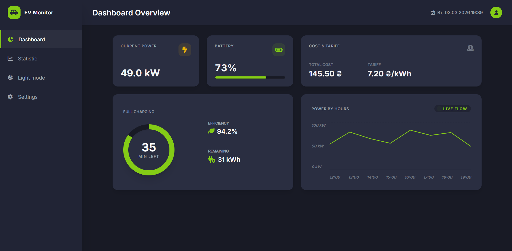
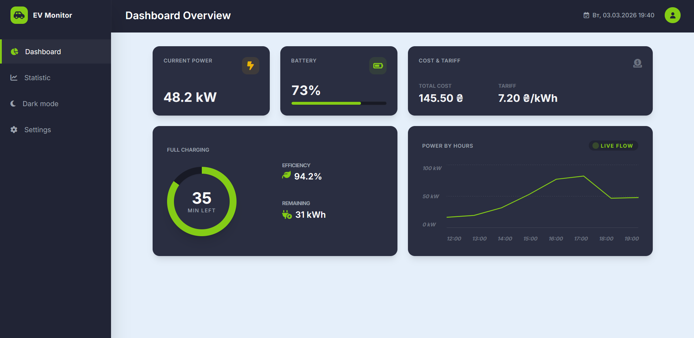
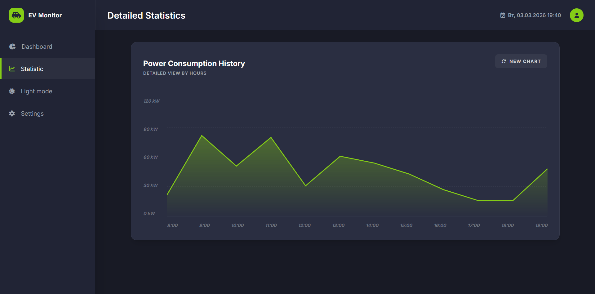
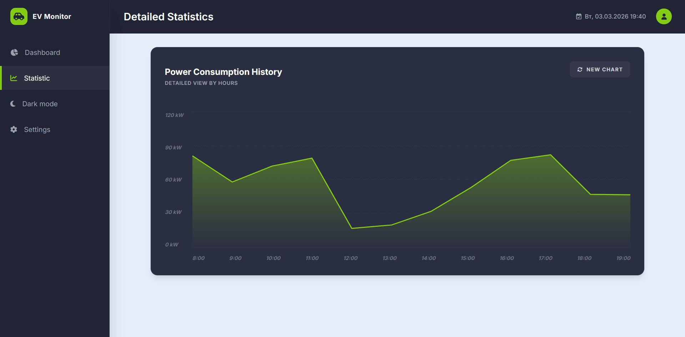
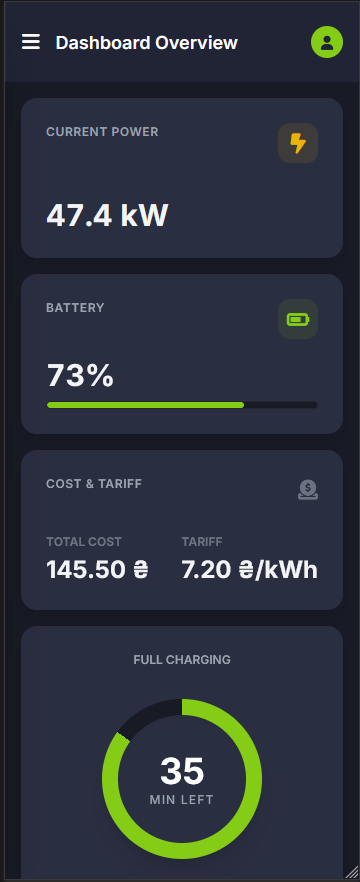
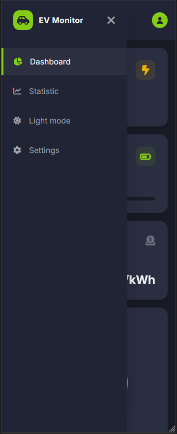

# EV Monitor

A dashboard for monitoring electric vehicle charging

Built with **HTML**, **Tailwind CSS**, and **JavaScript**. Supports dark and light themes.

## Launch
```bash
git clone https://github.com/LilRaime/ev-monitor.git
cd ev-monitor
```
```bash
npm init -y
npm install -D tailwindcss
npx tailwindcss -i ./src/css/input.css -o ./dist/output.css --watch
```

## Screenshots






### Mobile

<table>
  <tr>
    <td></td>
    <td></td>
  </tr>
</table>
